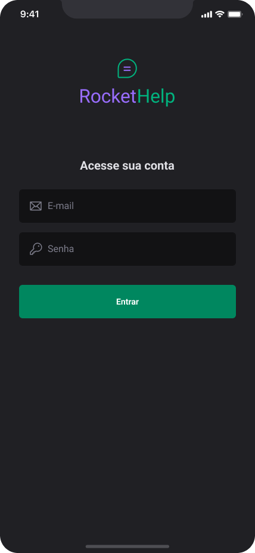

<h1 align="center">
  
<h1>

# 🌐 About

The **Rocket Help** project is a specialization in React Native for developers to reach their next level.

# 📱 Mobile

Login     |  Home
:-------------------------:|:-------------------------:
  |  

Home     |  Home
:-------------------------:|:-------------------------:
  |  

New Request     |  Request in Progress
:-------------------------:|:-------------------------:
  |  

Done Request     |
:-------------------------:|
  |

# 🤔 Technologies used

- [React Native](https://reactnative.dev/)
- [Expo](https://expo.dev/)
- [React Navigation](https://reactnavigation.org/)
- [Native Base](https://nativebase.io/)
- [Firebase](https://firebase.google.com/)

# 📁 How to download project

```bash
    # Clone repository
    $ git clone https://github.com/viniciusperrone/Rocket-Help.git
    # Enter directory
    $ cd mobile
    # Install all dependencies
    $ npm i
    
    # Start app
    $ expo run:android
```
